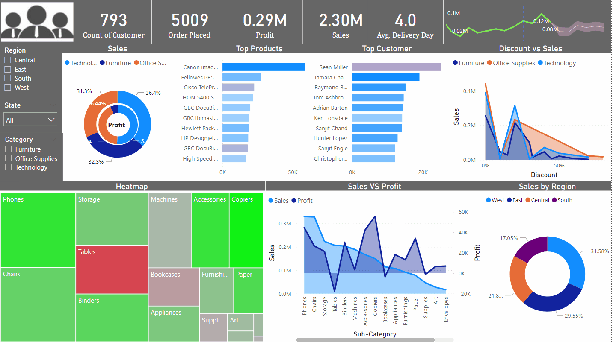

# PowerBi-Sales-Analysis

Sample Superstore Data Analysis using Power Bi

Dax Function Used : DateAdd, AddColumns, Filter, Calculate, Switch, If,Else,All, AllExcept, AllSelected

https://app.powerbi.com/groups/me/reports/219ed8ad-5720-4b65-8eed-4fe860138f94/ReportSectione99c9959143ddaa34922

Insight Can be Discovered by Dashboard:

1.Customer with most Sales but they are having Loss
2. More we Sell more we loss in the case of Table
3. Office Sales have less sale but it has good profit
4. Using Heatmap we can compare products for their  Sales vs Profit 
5. Using Sale Forecasting we can say that Technologies category have steady growth with no up and down 
6. Phone is the category more we sell but less profit 
